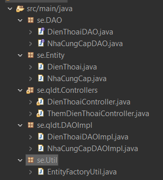
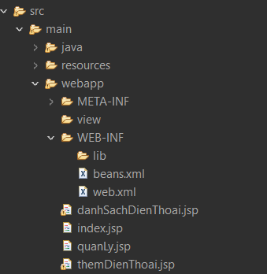

# Cấu trúc thư mục Source code

- java 



- web



# B1: Viết EntityFactoryUtil.java
```java
package se.Util;

import jakarta.persistence.EntityManager;
import jakarta.persistence.EntityManagerFactory;
import jakarta.persistence.Persistence;

public class EntityFactoryUtil {
	private EntityManagerFactory emf;
	private EntityManager em;
	public EntityFactoryUtil() {
		super();
		emf = Persistence.createEntityManagerFactory("LeMinhQuang_21089141_lab6_bai8");
		em = emf.createEntityManager();
	}
	public EntityManager getEntityManager() {
		return em;
	}
	public void close() {
		em.close();
		emf.close();
	}
}
```
# B2: Viết entity
- Tham khảo ```Readme JPA phân tán``` nếu quên cú pháp.

# B3: Chạy project MSSQL

# B4: Setup DAO sau đó đến DAOImpl

```java
package se.DAO;
import java.util.List;
import se.Entity.DienThoai;
public interface DienThoaiDAO {
	public List<DienThoai> findAll();
	public DienThoai findById(int madt);
	public DienThoai addDienThoai(DienThoai dt);
	public DienThoai updateDienThoai(DienThoai dt);
	public boolean deleteDienThoai(int madt);
}

public class DienThoaiDAOImpl implements DienThoaiDAO {
	private EntityFactoryUtil efu = new EntityFactoryUtil();
	private EntityManager em;
	public DienThoaiDAOImpl() {
		em = efu.getEntityManager();
	}
	@Override
	public List<DienThoai> findAll() {
		String sql = "select * from DIENTHOAI";
		try {
			List<DienThoai> list = em.createNativeQuery(sql, DienThoai.class).getResultList();
			return list;
		} catch (Exception e) {
			e.printStackTrace();
		}
		return null;
	}
}
```

# B5: Viết controller 

Tạo servlet class
```java
public class DienThoaiController extends HttpServlet {
	private static final long serialVersionUID = 1L;
	private DienThoaiDAOImpl dtDAO;

	public DienThoaiController() {
		dtDAO = new DienThoaiDAOImpl();
	}
}
```
 GET METHOD
```java
protected void doGet(HttpServletRequest request, HttpServletResponse response)
			throws ServletException, IOException {
		try {
//			dtDAO.addDienThoai(new DienThoai(1, "Samsung Galaxy A31", 2012, "Power CPU"));
//			dtDAO.addDienThoai(new DienThoai(2, "Xiaomi Redmi 5A", 2008, "Power"));
//			dtDAO.addDienThoai(new DienThoai(3, "Samsung Galaxy S2", 2014, "Power"));
			List<DienThoai> listDt = dtDAO.findAll();
			request.setAttribute("dsDT", listDt);
			request.getRequestDispatcher("danhSachDienThoai.jsp").forward(request, response);
		} catch (Exception e) {
			e.printStackTrace();
		}
	}
```
POST METHOD

```java
protected void doPost(HttpServletRequest request, HttpServletResponse response)
			throws ServletException, IOException {
		String action = request.getParameter("action");
		switch (action) {
		case "add": {
			add(request, response);
			break;
		}
		case "edit": {
			edit(request, response);
			break;
		}
		case "delete": {
			delete(request, response);
			break;
		}
		default:
		}
```

ADD and DELETE METHOD
```java
public void add(HttpServletRequest request, HttpServletResponse response) throws ServletException, IOException {
		try {
			String tenDienThoai = request.getParameter("tenDienThoai");
			String strNamSanXuat = request.getParameter("namSanXuat");
			String cauHinh = request.getParameter("cauHinh");
			String maNCC = request.getParameter("maNCC");
			NhaCungCap ncc = new NhaCungCap();
			ncc.setMancc(Integer.parseInt(maNCC));

			DienThoai dt = new DienThoai();
			dt.setCauhinh(cauHinh);
			dt.setNamsx(Integer.parseInt(strNamSanXuat));
			dt.setNhacungcap(ncc);
			dt.setTendt(tenDienThoai);
			if (dtDAO.addDienThoai(dt) != null) {
				request.getRequestDispatcher("DienThoaiController").forward(request, response);
			}

		} catch (Exception e) {
			e.printStackTrace();
			request.getRequestDispatcher("themDienThoai.jsp").forward(request, response);
		}
	}

	public void edit(HttpServletRequest request, HttpServletResponse response) throws ServletException, IOException {
		try {
			int madt = Integer.parseInt(request.getParameter("madt"));
			if (dtDAO.findById(madt) != null) {
				String tenDienThoai = request.getParameter("tenDienThoai");
				String strNamSanXuat = request.getParameter("namSanXuat");
				String cauHinh = request.getParameter("cauHinh");
				String maNCC = request.getParameter("maNCC");
				NhaCungCap ncc = new NhaCungCap();
				ncc.setMancc(Integer.parseInt(maNCC));

				DienThoai dt = new DienThoai();
				dt.setCauhinh(cauHinh);
				dt.setNamsx(Integer.parseInt(strNamSanXuat));
				dt.setNhacungcap(ncc);
				dt.setTendt(tenDienThoai);
				dtDAO.updateDienThoai(dt);
				response.sendRedirect("DienThoaiController");
			}
		} catch (Exception e) {
			e.printStackTrace();
			// TODO: handle exception
		}
	}
```

# B6: Code jsp để hiển thị danh sách và form

```Lưu ý 1: đi thi style thuần không dùng bootstrap được vì không có wifi```

### File index.jsp

```html
<%@ page language="java" contentType="text/html; charset=UTF-8"
	pageEncoding="UTF-8"%>
<!DOCTYPE html>
<html>
<head>
<meta charset="UTF-8">
<title>Insert title here</title>
<link rel="stylesheet"
	href="https://cdn.jsdelivr.net/npm/bootstrap@5.3.3/dist/css/bootstrap.min.css"
	integrity="sha384-QWTKZyjpPEjISv5WaRU9OFeRpok6YctnYmDr5pNlyT2bRjXh0JMhjY6hW+ALEwIH"
	crossorigin="anonymous">
</head>
<body>
	<div style="flex-direction: column;"
		class="container d-flex justify-between">
		<header style="width: 100%;" class="text-center border border-2">
			<a href="danhSachDienThoai.jsp" class="btn btn-link">Danh sách sản phẩm</a> | <a
				href="themDienThoai.jsp" class="btn btn-link">Thêm mới sản phẩm</a> | <a
				href="quanly.jsp" class="btn btn-link">Chức năng quản lý</a>
		</header>
		<main style="margin-top: 10px;">
			<h4>Vui lòng chọn chức năng:</h4>
		</main>
		<footer style="position: fixed; left: 0; bottom: 0; width: 100%;">
			<p class="container">Lê Minh Quang - 21089141</p>
		</footer>
	</div>
</body>
</html>
```

```Lưu ý 2: Để dùng các hàm của jsp, validate và không lỗi font, ta cần import:```

```java
<%@page import="java.io.IOException"%>
<%@page import="jakarta.validation.ConstraintViolation"%>
<%@page import="java.util.Set"%>
<%@ page language="java" contentType="text/html; charset=UTF-8"
	pageEncoding="UTF-8"%>
<%@ taglib uri="jakarta.tags.core" prefix="c"%>
```
### File add.jsp
- action : là tên controller xử lý form
- các input, select, checkbox: đều cần có name => để getParamater

```html
<form style="width: 800px;" action="ThemDienThoaiController" method="POST">
				<div class="mb-3">
					<label for="tenDienThoai" class="form-label">Tên điện thoại</label>
					<input type="text" class="form-control" id="tenDienThoai"
						name="tenDienThoai">
				</div>
				<div class="mb-3">
					<label for="namSanXuat" class="form-label">Năm sản xuất</label> <input
						type="number" class="form-control" id="namSanXuat"
						placeholder="2024" name="namSanXuat">
				</div>
				<div class="mb-3">
					<label for="cauHinh" class="form-label">Cấu hình</label> <input
						type="text" class="form-control" id="cauHinh" name="cauHinh">
				</div>
				<div class="mb-3">
					<label for="cauHinh" class="form-label">Nhà cung cấp</label> <select
						class="form-select" name="maNCC">
						<option value="1">Apple</option>
						<option value="2">Samsung</option>
						<option value="3">Xiaomi</option>
					</select>
				</div>

				<button type="submit" class="btn btn-primary">Submit</button>
			</form>
```

- Lặp ra list danh sách điện thoại
- Với listDienThoai lấy từ session 
- href="manage-phone?action=delete&id=${item.maDienThoai}" : truyền param với method post để handle data
```html
	<c:forEach items="${listDienThoai}" var="item">
						<tr>
							<td>${item.maDienThoai}</td>
							<td>${item.tenDienThoai}</td>
							<td>${item.namSanXuat}</td>
							<td>${item.cauHinh}</td>
							<td><a
								href="manage-phone?action=delete&id=${item.maDienThoai}"
								class="btn btn-danger">Xóa</a></td>
						</tr>
					</c:forEach>
```