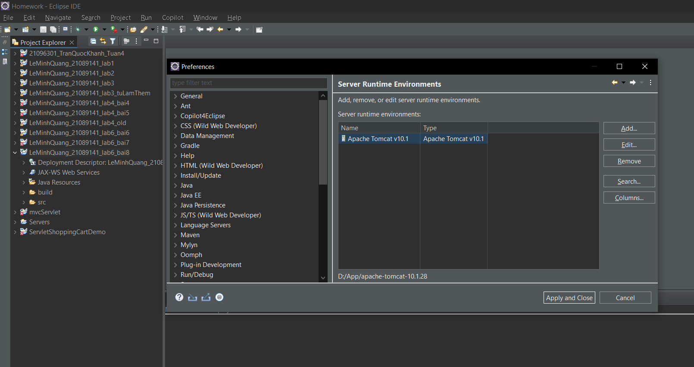
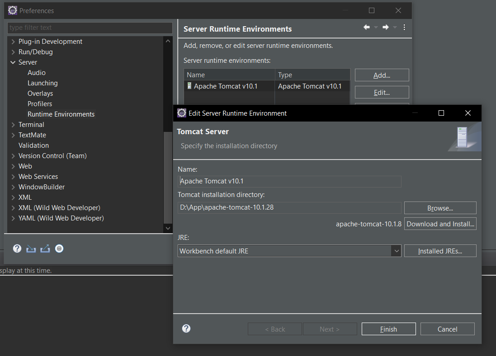
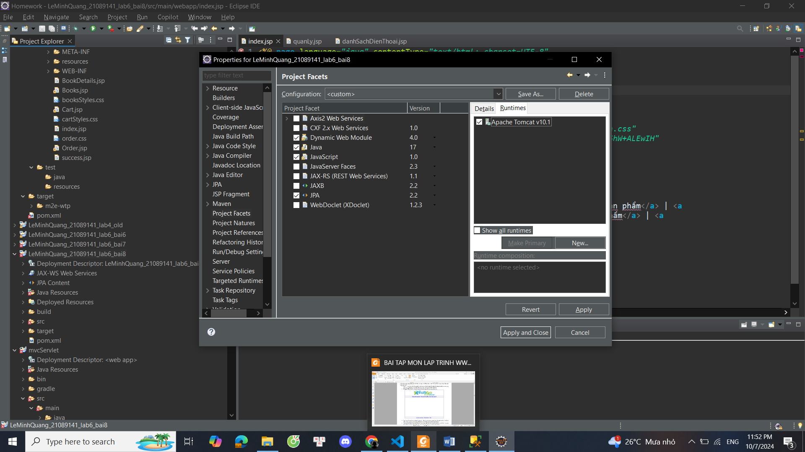
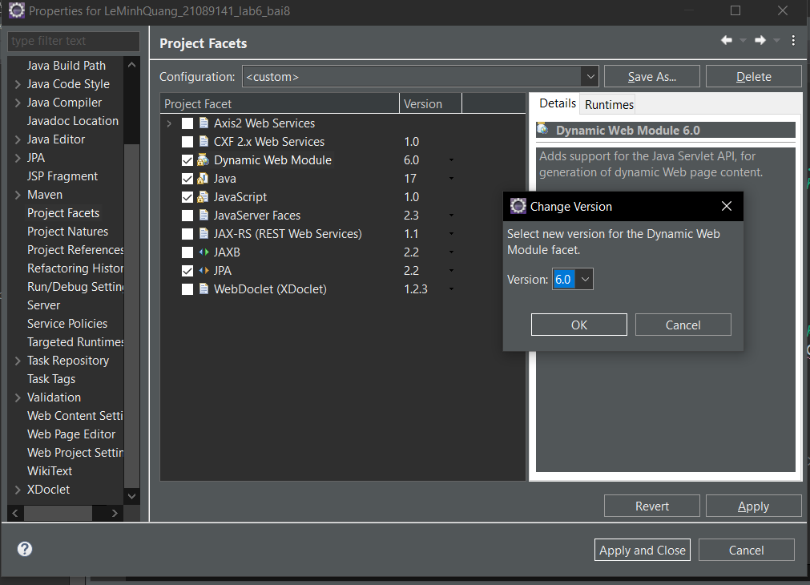

# Topic 1: Setup Project, fixing bug project,
### Fix lỗi MSSQL không connect được bằng Hibernate
Tham khảo tại video:  [Config JPA - Socket final exam ( fix TLS, default lib version) IUH -2024](https://www.youtube.com/watch?v=AjZi9KIai0Y&t=5s)

    Phút 0 - 2:00: fix lỗi sa password

    Phút 6:29 - 7:30: fix lỗi TLS 1.0

    Phút 9:50 - 10:05 fix lỗi jdk default -> chuyển sang đúng JDK

### Setup Project
#### import tomcat server 


Chọn path của server cá nhân


Check runtime server



### Check version dynamic project web 


# Topic 2: Setup pom.xml, persistence.xml, web.xml:

## File pom.xml:

```xml
 <dependencies>
		<!-- JSP and Servlets API-->
		<dependency>
			<groupId>jakarta.servlet</groupId>
			<artifactId>jakarta.servlet-api</artifactId>
			<version>6.0.0</version>
			<scope>provided</scope>
		</dependency>
		<dependency>
			<groupId>jakarta.servlet.jsp</groupId>
			<artifactId>jakarta.servlet.jsp-api</artifactId>
			<version>3.1.1</version>
			<scope>provided</scope>
		</dependency>

		<!-- JSTL -->
		<dependency>
			<groupId>jakarta.servlet.jsp.jstl</groupId>
			<artifactId>jakarta.servlet.jsp.jstl-api</artifactId>
			<version>3.0.0</version>
		</dependency>
		<dependency>
			<groupId>org.glassfish.web</groupId>
			<artifactId>jakarta.servlet.jsp.jstl</artifactId>
			<version>3.0.1</version>
		</dependency>


		<!-- Jakarta Persistence API -->
		<dependency>
			<groupId>org.hibernate</groupId>
			<artifactId>hibernate-core</artifactId>
			<version>6.4.4.Final</version>
		</dependency>

		<!-- Hibernate validator -->
		<dependency>
			<groupId>org.hibernate.validator</groupId>
			<artifactId>hibernate-validator</artifactId>
			<version>8.0.0.Final</version>
		</dependency>
		<dependency>
			<groupId>org.hibernate</groupId>
			<artifactId>hibernate-validator</artifactId>
			<version>8.0.0.Final</version>
		</dependency>

		<!-- MySQL JDBC driver -->
		<dependency>
			<groupId>com.microsoft.sqlserver</groupId>
			<artifactId>mssql-jdbc</artifactId>
			<version>12.3.0.jre17-preview</version>
			</dependency>
	</dependencies>
```

## File persistent.xml

```xml

<persistence-unit name="jpa-mssql">
<provider>org.hibernate.jpa.HibernatePersistenceProvider</provider>
<properties>
<property name="jakarta.persistence.jdbc.driver" value="com.microsoft.sqlserver.jdbc.SQLServerDriver"/>
<property name="jakarta.persistence.jdbc.dialect" value="org.hibernate.dialect.SQLServerDialect"/>
<property name="hibernate.connection.url" value="jdbc:sqlserver://localhost:1433;databaseName=school;trustServerCertificate=true;encrypt=true;"/>
<property name="hibernate.connection.username" value="sa"/>
<property name="hibernate.connection.password" value="sapassword"/>
<property name="hibernate.hbm2ddl.auto" value="update"/>
<property name="hibernate.show_sql" value="false"/>
<property name="hibernate.format_sql" value="true"/>
</properties>
</persistence-unit>
```
## File web.xml

```xml
 <servlet> // tạo servlet cần map với tên DanhSachTinTucQuanLy
    <description></description>
    <display-name>DanhSachTinTucQuanLy</display-name>
    <servlet-name>DanhSachTinTucQuanLy</servlet-name>
    <servlet-class>controllers.DanhSachTinTucQuanLy</servlet-class>
  </servlet>
  <servlet-mapping> //mapping với url trong source với tên servlet vừa tạo
    <servlet-name>DanhSachTinTucQuanLy</servlet-name>
    <url-pattern>/DanhSachTinTucQuanLy</url-pattern>
  </servlet-mapping>
```
