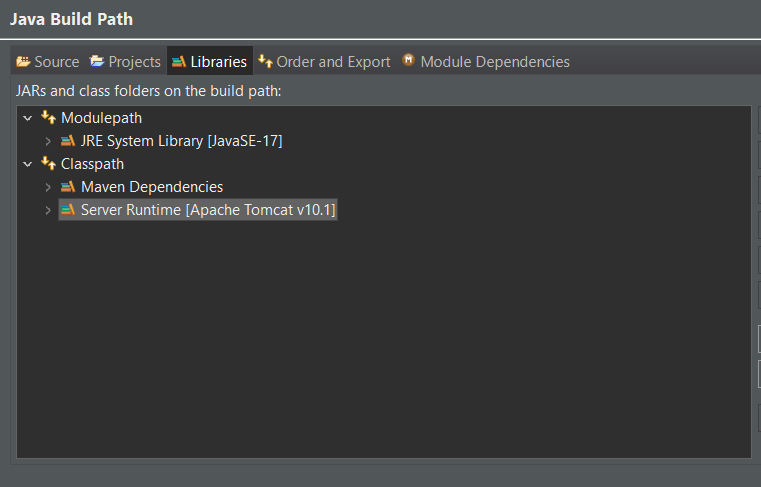
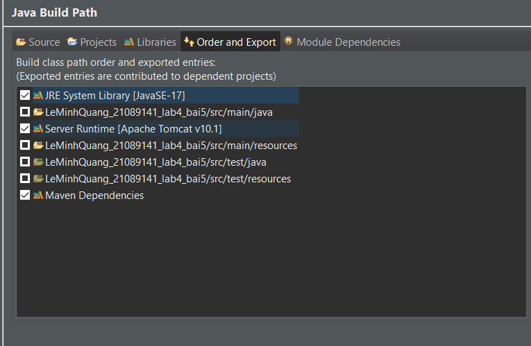
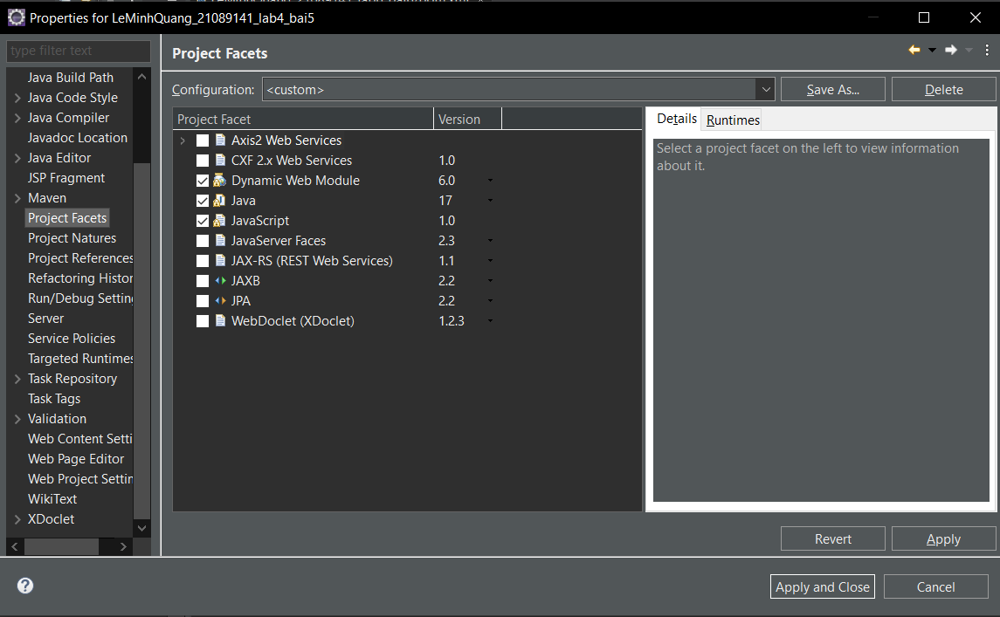
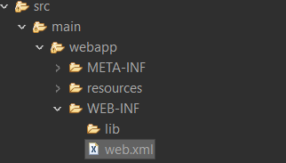
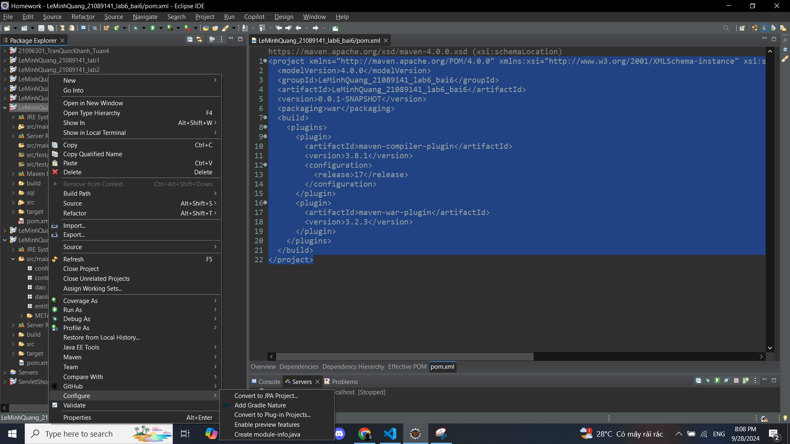
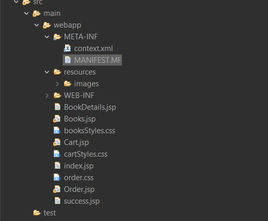

# Setup servlet java

## 1/ Dynamic project web

- Build path:




- Project facets:

Chọn đúng version java: trong hình là Java 17.



- Build web

Truy cập vào cây thư mục, tìm file web.xml



Mẫu file

```javascript
  <build>
    <plugins>
      <plugin>
        <artifactId>maven-compiler-plugin</artifactId>
        <version>3.8.1</version>
        <configuration>
          <release>17</release>
        </configuration>
      </plugin>
      <plugin>
        <artifactId>maven-war-plugin</artifactId>
        <version>3.2.3</version>
      </plugin>
    </plugins>
  </build>
```

## 2/ Maven project

Chọn convert to Maven project (vì project mình đã setup sẵn nên không có option đó)



### Setup ```pom.xml```

File mẫu:

```javascript
	<dependencies>
		<!--  drive connect MSSQL  -->
		<dependency> 
			<groupId>com.microsoft.sqlserver</groupId>
			<artifactId>mssql-jdbc</artifactId>
			<version>12.8.1.jre11</version>
		</dependency>
		<!--  servlet api -> dùng method HTTP  -->
		<dependency>
			<groupId>jakarta.servlet</groupId>
			<artifactId>jakarta.servlet-api</artifactId>
			<version>6.0.0</version>
			<scope>provided</scope>
		</dependency>
		<!--  jsp api  -->
		<dependency>
			<groupId>jakarta.servlet.jsp</groupId>
			<artifactId>jakarta.servlet.jsp-api</artifactId>
			<version>3.1.1</version>
			<scope>provided</scope>
		</dependency>
		<dependency>
			<groupId>jakarta.servlet.jsp.jstl</groupId>
			<artifactId>jakarta.servlet.jsp.jstl-api</artifactId>
			<version>3.0.0</version>
		</dependency>
		<dependency>
			<groupId>org.glassfish.web</groupId>
			<artifactId>jakarta.servlet.jsp.jstl</artifactId>
			<version>3.0.1</version>
		</dependency>
        <!-- Jakarta Enterprise Beans phiên bean hay entity bean.-->
		<dependency>
			<groupId>jakarta.ejb</groupId>
			<artifactId>jakarta.ejb-api</artifactId>
			<version>4.0.1</version>
		</dependency>
        <!-- Cung cấp các chú thích chuẩn của Jakarta cho quản lý vòng đời và tài nguyên. -->
		<dependency>
			<groupId>jakarta.annotation</groupId>
			<artifactId>jakarta.annotation-api</artifactId>
			<version>3.0.0</version>
			<scope>provided</scope>
		</dependency>
        <!-- Cung cấp CDI cho môi trường Servlet -->
		<dependency>
			<groupId>org.jboss.weld.servlet</groupId>
			<artifactId>weld-servlet-core</artifactId>
			<version>5.1.2.Final</version>
		</dependency>
	</dependencies>
```

### Setup Apache-Tomcat to init CSDL (DataSource) bind to (SQL Server)

- Truy cập file ``context.xml``



- Setup Datasource

```javascript 
<Context>
	<Resource name="jdbc/bookStore" auth="Container"
		type="javax.sql.DataSource" maxTotal="100" maxIdle="30"
		maxWaitMillis="10000" username="sa" password="sapassword"
		driverClassName="com.microsoft.sqlserver.jdbc.SQLServerDriver"
		url="jdbc:sqlserver://localhost:1433;encrypt=false;databaseName = bookStore;" />
</Context>

```

```name="jdbc/bookStore"```: Đây là tên tài nguyên (Resource) mà ứng dụng của bạn sẽ tham chiếu đến.

```username="sa"```: Tên người dùng (username) để kết nối đến cơ sở dữ liệu. 

```password="sapassword"``` Mật khẩu để kết nối đến cơ sở dữ liệu với người dùng sa.

```url="jdbc:sqlserver://localhost:1433;encrypt=false;databaseName=bookStore;"``` : URL kết nối đến cơ sở dữ liệu

## 3/ JPA project
